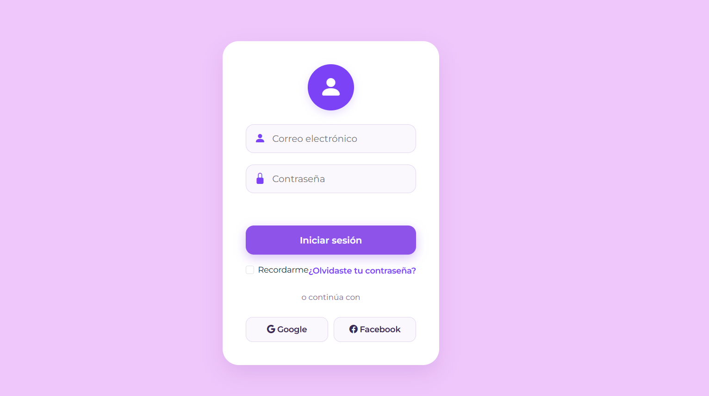
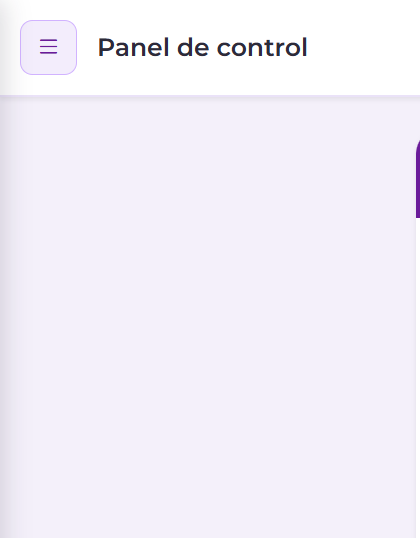
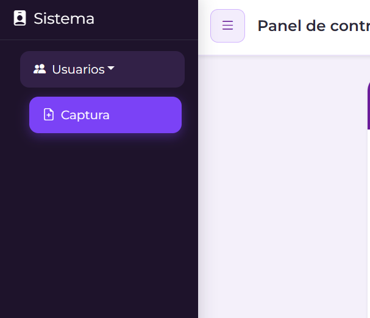
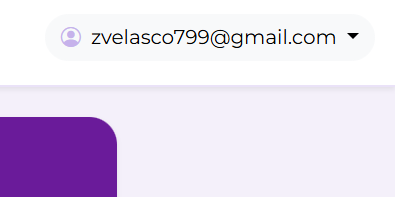
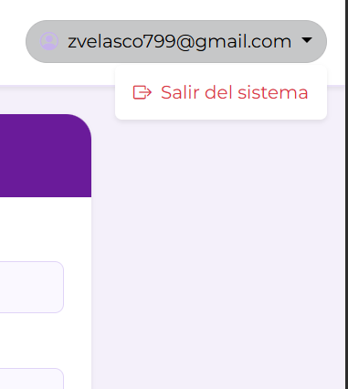
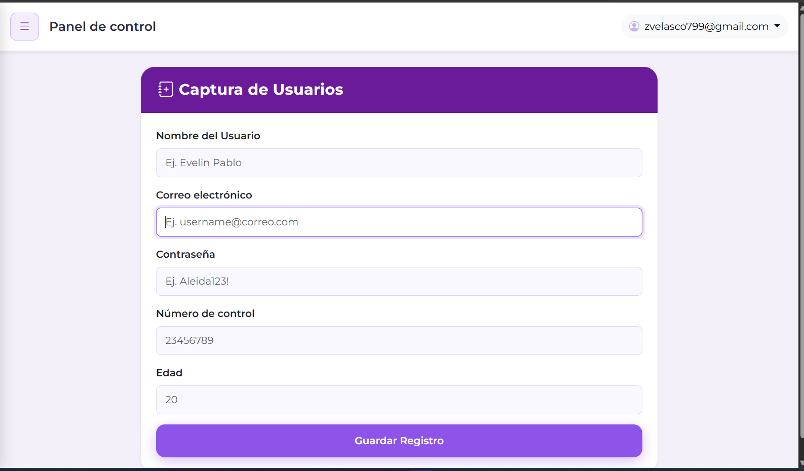
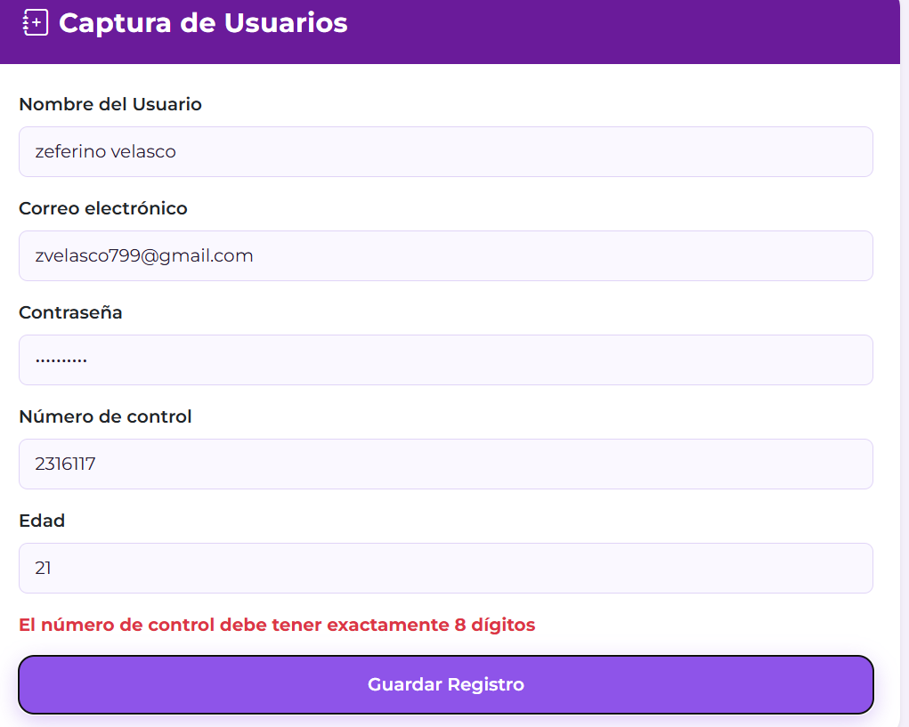
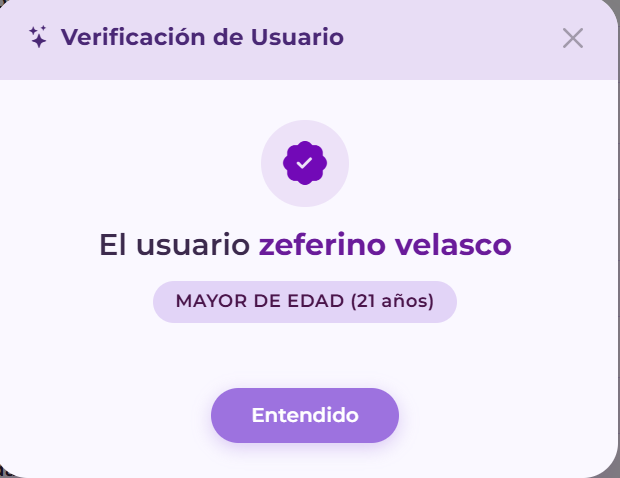
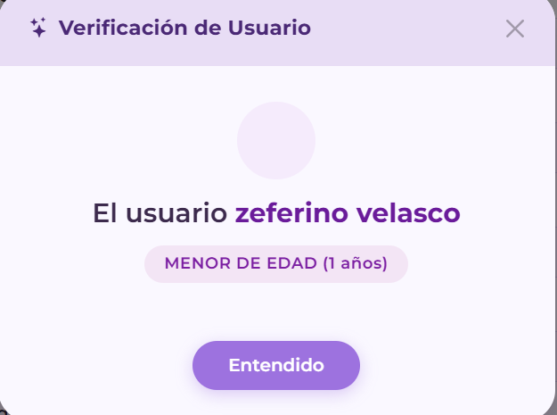

#  Proyecto Login - Actividad 5

---

## Portada e Información General

* **Proyecto:** Sistema de Control de Usuarios e Interfaz Web
* **Materia:** Programación Web
* **Integrantes del Equipo:**
  * Aleida Pablo
  * velasco martinez zeferino
* **Descripción Breve:** 
  Aplicación web interactiva compuesta por un módulo de inicio de sesión *Login* con validaciones estrictas y un panel principal *Dashboard* que incluye menú lateral colapsable, barra de navegación personalizada con datos de sesión, formulario de captura de datos de usuario en tiempo real y verificación de edad mediante modal interactivo.

---

## Explicación y Documentación Técnica

### 1. Framework y Librerías CSS
* **Bootstrap 5.3.3:** Utilizado para el diseño adaptable, sistema de rejilla *grid system*, componentes de modales y menús desplegables.
* **Bootstrap Icons 1.11.3:** Iconos para los elementos del sidebar, entradas de texto, botones y tarjetas de estado.
* **CSS Estilo Personalizado:** Paleta de colores "Mystic Violet & Mint" basada en tonos pastel lila (`#e8ddf5`) y morados   (`#7b42f6`, `#1e132b`) para garantizar una interfaz estética, limpia y moderna.

### 2. Flujo desde el Login hacia el Sistema
1. El usuario ingresa sus credenciales en `login.html`.
2. Al dar clic en **Iniciar Sesión**, el script valida el formato del correo y las reglas de seguridad de la contraseña.
3. Si la validación es correcta, se guarda el correo electrónico en el almacenamiento de la sesión del navegador mediante `sessionStorage.setItem('usuario', correo)`.
4. El sistema redirige automáticamente al usuario a la pantalla principal (`index.html`).
5. En `index.html`, un script verifica la existencia de la sesión; si no hay un usuario registrado en `sessionStorage`, el sistema bloquea el acceso y redirige de vuelta al login.

### 3. Transferencia del Nombre de Usuario al Navbar
* En `js/index.js`, al cargar el DOM, se ejecuta la lectura de la sesión:
  ```javascript
  const correoUsuarioSesion = sessionStorage.getItem('usuario');
---

## 4. Proceso de Creación

### 1. Login
Se diseñó `login.html` con el formulario de correo y contraseña, el botón **Iniciar sesión**, la opción **Recordarme** y los accesos con Google y Facebook. Las validaciones se conectaron en `login.js` con las funciones de `utileria.js`.




### 2. Sidebar (menú lateral)
Se creó el menú lateral con la opción **Usuarios** y su submenú desplegable **Captura**. El botón hamburguesa abre y cierra el menú.






### 3. Navbar con el usuario
En la parte derecha de la barra superior se muestra el correo capturado en el login. Al dar clic se despliega el menú con la opción **Salir del sistema**.





### 4. Número de control
Se agregó el campo al formulario de captura y se valida que tenga exactamente 6 dígitos.





### 5. Modal de edad
Al guardar un registro válido se abre un modal que indica si la persona es mayor o menor de edad.





---

